# MongoDB

## 安装环境

* Operation system :  redhat7
* Install packages path: /home/mongo
* mongodb server IP: 10.96.43.105
* username : root
* Password: abc.0813               
*   //change it if necessary

## 安装mongoDB

* 将安装文件上传到服务器的目录下面

* 登录要安装的mongodb服务器
* 进入到有安装包的目录（这里使用的是/home/mongo）

```shell
cd /home/mongo
```
* 运行命令

```shell
rpm -ivh mongodb-enterprise-server-4.0.2-1.el7.x86_64.rpm
rpm -ivh mongodb-enterprise-mongos-4.0.2-1.el7.x86_64.rpm
rpm -ivh mongodb-enterprise-tools-4.0.2-1.el7.x86_64.rpm
rpm -ivh mongodb-enterprise-shell-4.0.2-1.el7.x86_64.rpm
```
* 如在安装过程中部分安装包的依赖关系无法满足，使用yum install 相应的包的名称，解决依赖关系
```shell
yum install the_package_name_what_you_want
```
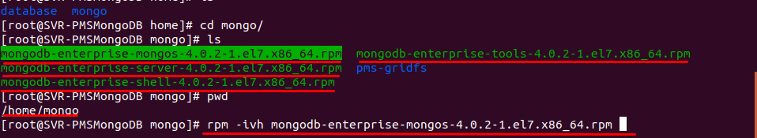


## 启动mongoDB服务 
* 启动mongodb服务

```shell
systemctl start mongod.service
```
* 停止mongodb服务

```shell
systemctl stop mongod.service
```

* 将mongodb加入开机自动服务

```shell
systemctl enable mongod.service 
```
* 将mongodb移除开机自启动服务

```shell
systemctl disable mongod.service
```

* 查看mongodb状态

```shell
systemctl status mongod.service
```
* 如果满足图中标识的部分，则表示运行正常
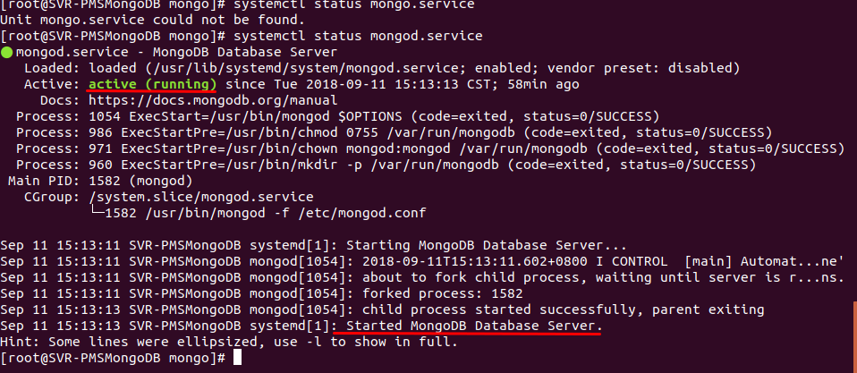

## 说明
* mongodb配置文件存放位置：/etc/mongo.conf
* mongodb log文件位置 ： /var/log/mongo/mongo.log
* mongodb 数据存放位置 :/home/database/mongo


# Nginx

## 服务器环境
* system: redhat7
* Nginx server IP: 10.96.43.97
* username: root
* password: abc.0813               
*   //change it if necessary

## 编译安装nginx

* nginx 下载地址http://nginx.org/en/download.html
* 解压安装包

```shell
tar -xzvf nginx.tar.gz
```
* 进入安装目录

```shell
cd nginx-1.15.2
```
* 配置编译环境(--prefix  指定Nginx的安装路径)

```shell
./configure --prefix=/home/nginx
```


* 编译nginx
```shell
make
```
* 安装nginx
```shell
make install
```
**注意**

* nginx 在安装过程中可能需要root权限
* 安装完后,要在命令行运行nginx命令,要将/home/nginx/sbin 加入path路径

## 运行nginx
```shell
nginx -c /home/nginx/conf/nginx.conf
```
## 停止nginx
```shell
pkill nginx
```
## 说明
* 运行的时候请确保Nginx所使用的80端口开放
* 运行查看Nginx是否占用的正确的端口(使用root权限)
```shell
sudo netstat -ntlp
```


# Weblogic

## 准备工作
* 将weblogic安装文件放在/home/weblogic下

## 配置JAVA JDK
* 将java jdk 文件夹服务制到/usr/local/share目录下
```shell
cp -r jdk1.8.0._181 /usr/local/share
```
* 配置Java环境变量
```shell
vim /etc/profile
```
* 将以下内容追加到文件中
```shell
export JAVA_HOME=/usr/local/share/jdk1.8.0_181
export JRE_HOME=$JAVA_HOME/jre
export PATH=$JAVA_HOME/bin:$PATH
```

* 重启服务器使环境变量生效
```shell
sudo init 6
```
## 安装weblogic

* 启动安装程序
```shell
java -jar fmw_12.2.1.3.0_infrastructure.jar
```

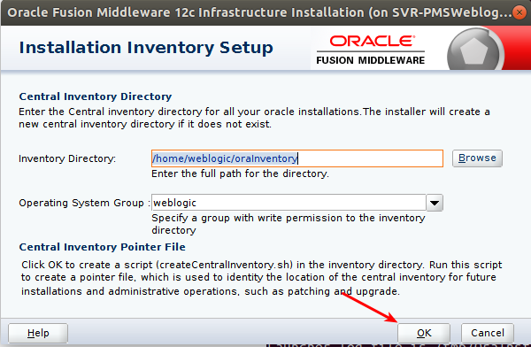

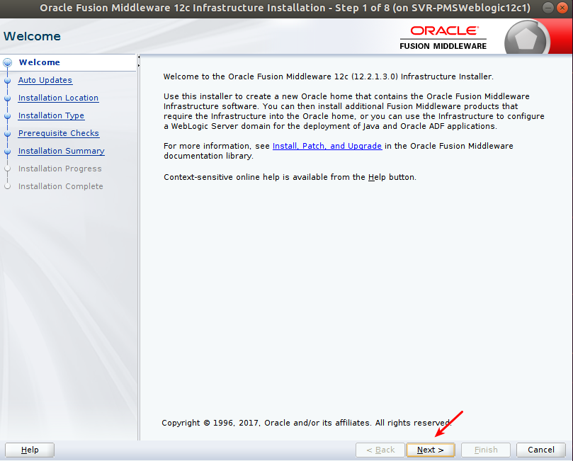

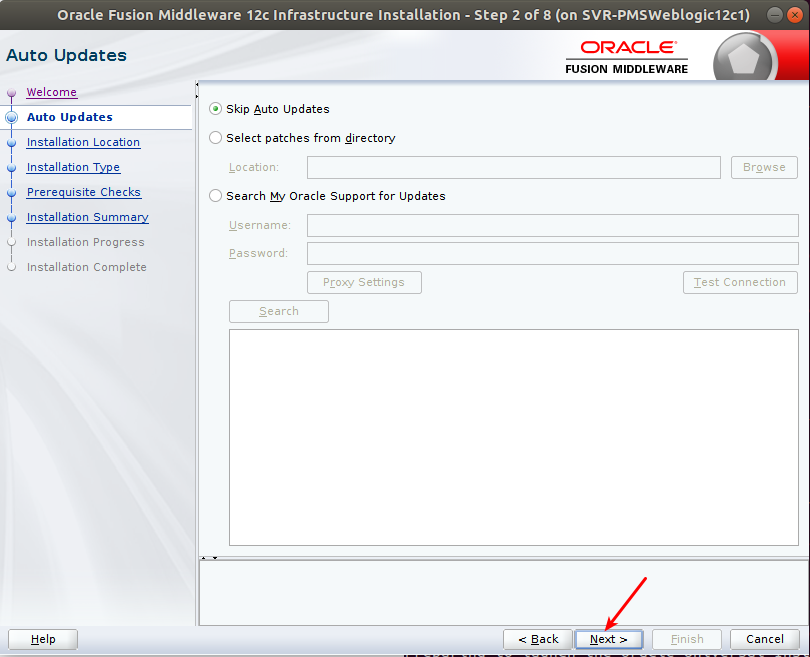

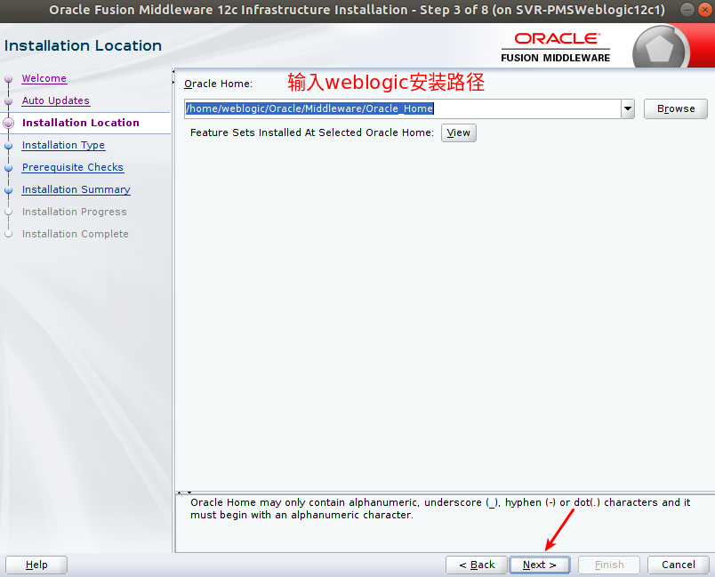

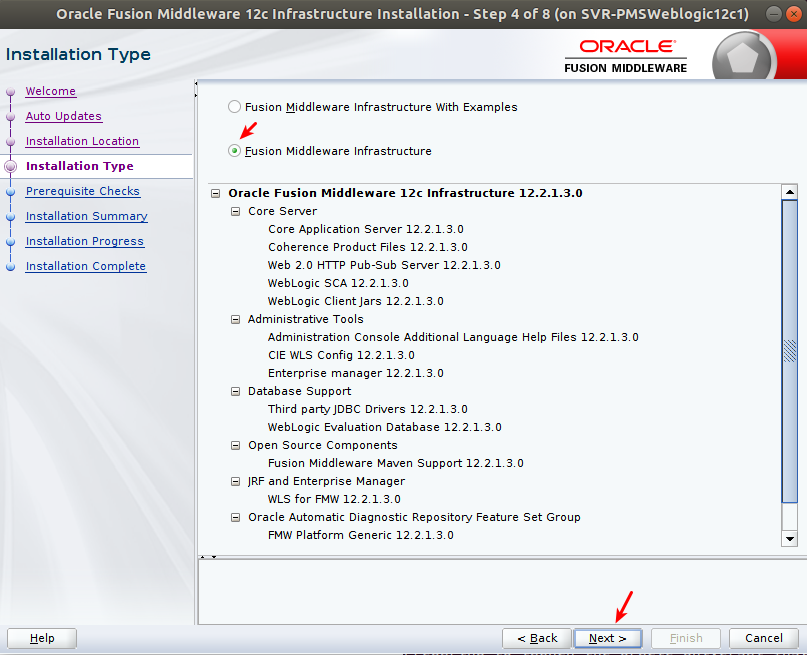


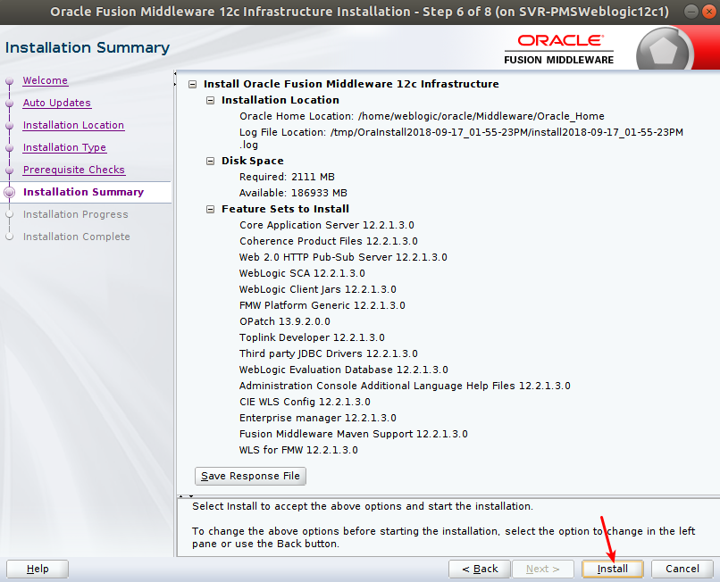

## 创建Weblogic域

* 进入目录
```shell
cd /home/weblogic/Oracle/Middleware/Oracle_Home/wlserver/common/bin
此目录/home/weblogic/Oracle/Middleware/Oracle_Home/为安装weblogic时所输入的目录
```
* 运行脚本

```shell
./config.sh
```
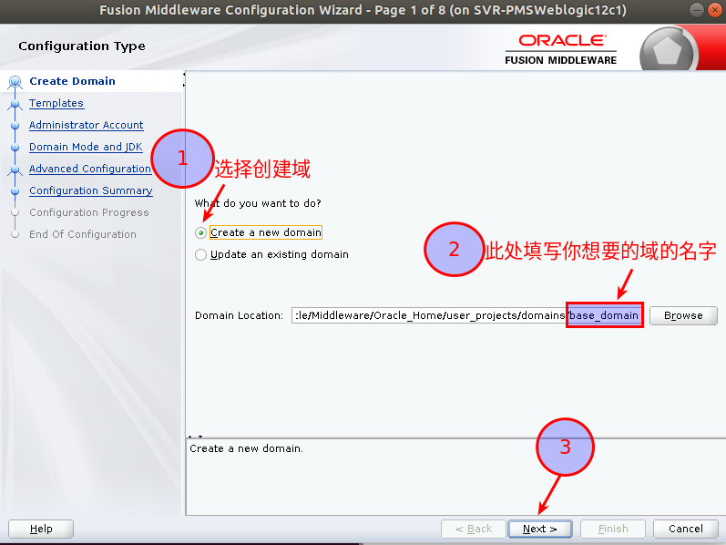


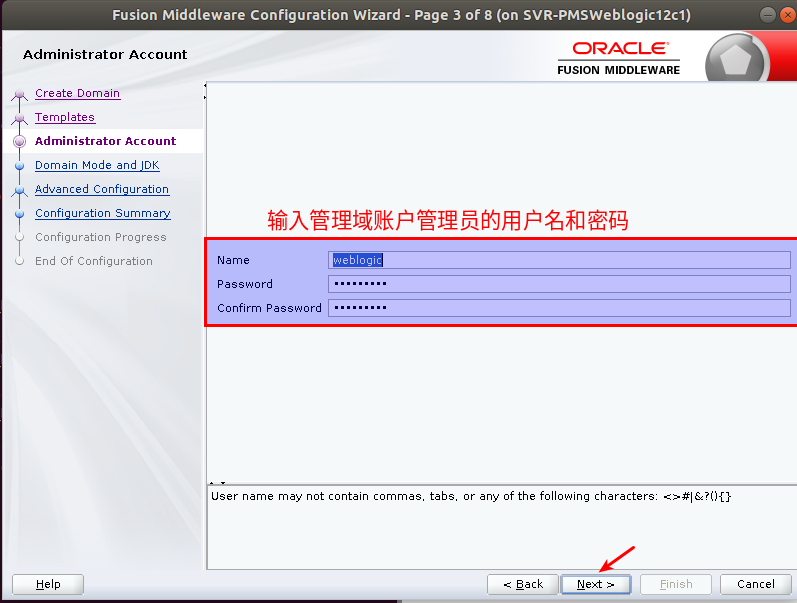

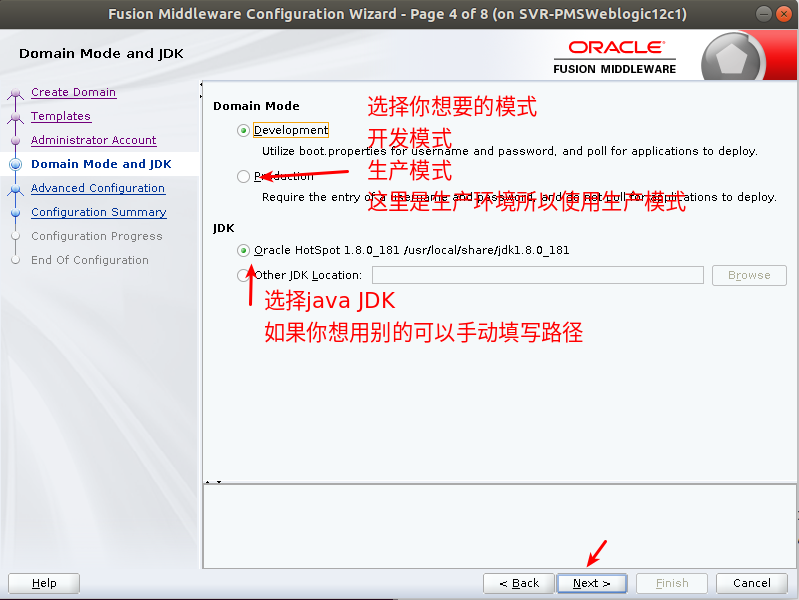


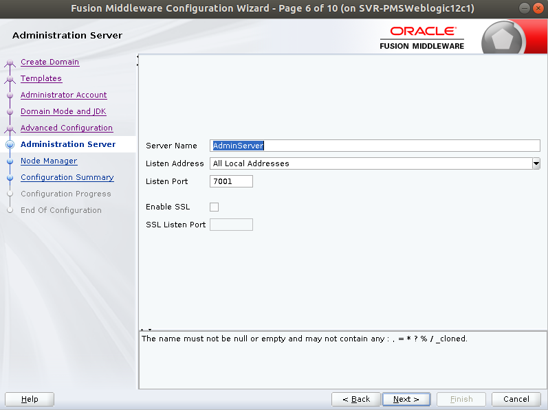


### 初始化weblogic管理节点

* 进入weblogic domain目录

```shell
cd /home/weblogic/Oracle/Middleware/Oracle_Home/user_projects/domains/PMS_domain/bin
```
* 启动weblogic administrator server

```shell
./startWeblogic.sh
```
* 输入用户名密码(在创建域的时候所设定的管理员用户名和密码)
* 按Ctrl+c 结束命令

**设置不使用weblogic管理员密码启动管理端**
* 进入管理服务器目录

```shell
cd /home/weblogic/Oracle/Middleware/Oracle_Home/user_projects/domains/PMS_domain/servers/AdminServer
```
* 创建目录sercurity  进入security目录

```shell
mkdir security
cd    security
```
* 创建boot.properties
```shell
vim boot.properties
```
* 在文件中写入

```shell
# password and username is the password and username which to create administrator server
username=weblogic
password=weblogic1
```
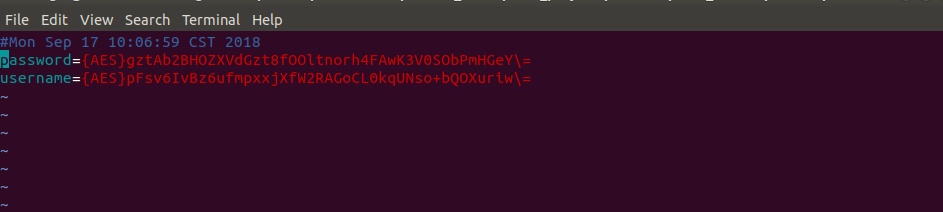

* 将./startWeblogic挂载到后台执行

```shell
nohup ./startWeblogic.sh > nohup.out 2>&1 &
```
* 查看启动进程

```shell
tail -f nohup.out
```


##  创建weblgoic 集群

**说明**

如果使用的是单节点的weblogic服务器,到上一步就可结束,如果有多个weblogic节点想要构成cluster,请将安装weblogic步骤,所产生的文件全部复制到其他节点,并将java 的配置复制一份到相应的节点;


### 注册Nodemanager 
#### 准备工作
* 复制weblogic文件

```shell
scp -r /home/weblogic/Oracle weblogic@10.96.43.99:/home/weblogic/
```

* 登录到相应的服务器

```shell
ssh weblogic@10.96.43.99
```
* 启动weblogic 管理节点

```shell
nohup ./startWeblogic.sh > nohup.out 2>&1 &
```
* 修改weblogic nodemanager properties
* 在/home/weblogic/Oracle/Middleware/Oracle_Home/user_projects/domains/PMS_domain/nodemanager目录下有一个nodemanager.properties文件
* 编辑nodemanager.properties文件
```shell
vim nodemanager.properties
```


**注释**
1. 如果nodemanager跟管理节点在同一个节点上,这里填写localhost
	如果nodemanager 跟管理节点不在同一个节点上,这里填写nodemanager所在节点的IP地址
2. 此处将true改为false


#### 向管理节点注册Nodemanager
* 运行wlst命令模式

```shell
./wlst.sh
```
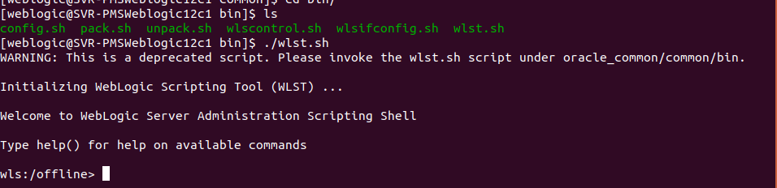

* 连接管理节点

```shell
wls:/offline> connect('weblogic','weblogic1','t3://10.96.43.98:7001')
```

**注释**
括号内内容从左向右依次为管理节点的用户名,密码,IP:端口号

* 向域中注册Nodemanager

```shell
wls:/PMS_domain/serverConfig/> nmEnroll('/home/weblogic/Oracle/Middleware/Oracle_Home/user_projects/domains/PMS_domain','/home/weblogic/Oracle/Middleware/Oracle_Home/user_projects/domains/PMS_domain/nodemanager')
```

* 注册成功后退出

```shell
wls:/PMS_domain/serverConfig/>  exit()
```

### 建立集群

#### 登录weblogic管理节点


#### 创建集群


* 1.点击集群
* 2.锁定并编辑
* 3.点击new下拉列表中的cluster选项创建集群


#### 编辑集群信息


* 1.填写集群名称
* 2,选择集群类型(两种都可选)
* 3.点击ok保存
* 4.点击激活更改

#### 创建计算机


* 1.点击machines
* 2.点击锁定并编辑
* 3.点击new 开始创建计算机


* 1.填写计算机名称
* 2.点击next进入下一步


*  1.选择普通模式(Plain)
* 2.填写监听地址(填写内容为物理机的IP地址)
* 3.填写监听端口(默认值为5556,可不做更改)
* 4.点击finish
* 5.激活更改
 **说明**
这里我们有两台物理机,所以以上过程要走两遍


#### 为集群创建服务器

* 1.点击server 
* 2.点击锁定并编辑
* 3.点击new,开始为集群创建服务器


* 1,填写服务器名称
* 2.填写服务器所运行的物理机的地址
* 3,填写服务器的监听地址(一般为7003)
* 4.5.将服务器加入到集群中
* 6.点击next,finish查看信息或完成
* 7.激活更改


* 1.选择刚创建的服务器
* 2.在计算机(machine)选项中选择对应IP地址的计算机

#### 启动服务器

* 1.选择控制页面(control)
* 2.选中刚创建的文件服务器
* 3.点击start,启动服务器
* 4.状态变为runing的时候,则表示启动成功


# P6EPPM

## 初始化数据库

### 运行赋权脚本
* 初始化数据库之前先运行脚本
* 脚本位置为p6suite/database/scripts/install/PM_17_12_00/manual_script_before_install.sql
### 运行安装命令
```shell
cd p6suite/database
sh dbsetup.sh
```


### 连接数据库


* 填写相应的连接信息
###  创建P6用户


* 用户名不要做改动,密码和用户名相同
* 下面设置p6网页登录的用户名和密码

## 安装P6 API
### 进入API安装目录
```shell
cd P6_R1712_Integration_API_linux/Disk1/install
```

### 运行安装命令
```shell
sh runInstaller.sh
```


* 点击next进入下一步


* 选择local mode的安装模式
* 点击next 进入下一步


* 填写API文件夹的名字
* 填写API文件夹的路径(这里要记住,后面要用)


*  选择安装选项
*  点击next进入下一步


* 填写Java JDK路径
* 点击next进入下一步


* 检查确认安装信息
* 点击install,开始安装

### 为P6 API配置Weblogic域

[考上一章 weblogic 配置过程为p6 创建域(按住ctrl点击跳转)](#Weblogic)

```shell
cd /home/weblogic/Oracle/Middleware/Oracle_Home/user_projects/domains/p6eppm_domain/bin
```
#### 编辑setDomainEnv.sh

```shell
vim setDomainEnv.sh
```


####　编辑weblogic 运行内存


#### 编辑添加P6 API路径

* 在JAVA_OPTIONS后台添加 P6 API路径
```
 -Dprimavera.bootstrap.home=/home/weblogic/P6IntegrationAPI_1
```
* 添加完成后重启weblogic服务器使配置生效

### 部署P6应用

#### 登录weblogic管理界面


#### 安装新应用

* 1.点击部署(deployment)
* 2.点击锁定并编辑(lock&Edit)
* 3.点击安装(install)


* 1.选择安装包的路径
* 2.选择p6安装包
* 点击next,进入下一步


* 选择 作为一个应用部署


* 选择部署到为p6 创建的集群


* 选择将文件部署到每一个目标


* 1.点击save保存
* 2.点击激活更改(active changes)使变更生效


* 1.点击部署(deployment)
*  2.选择控制页签(control)
*  3.选择start 为所有请求服务(servicing all request)


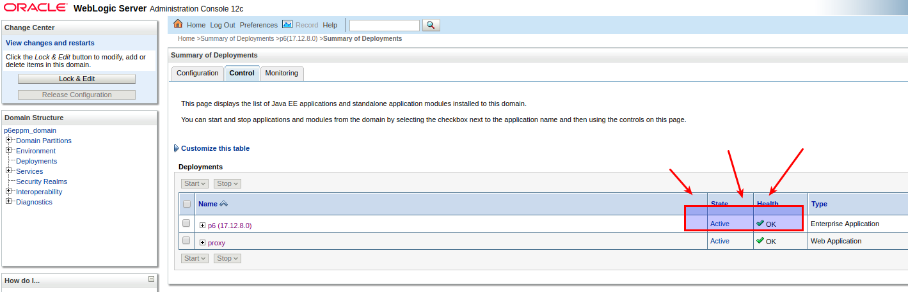

* 如果查看状态为active ,ok 则成功运行


* 查看p6 登录页面


* 使用数据库初始化时配置的admin账户登录成功


